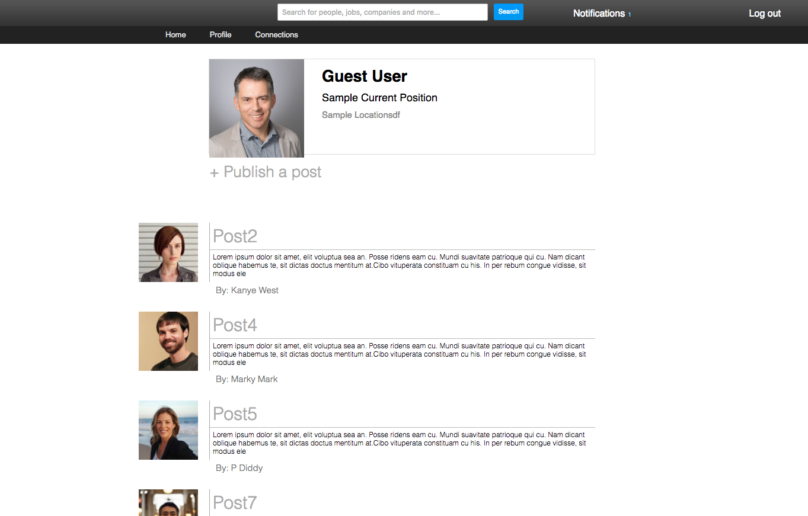
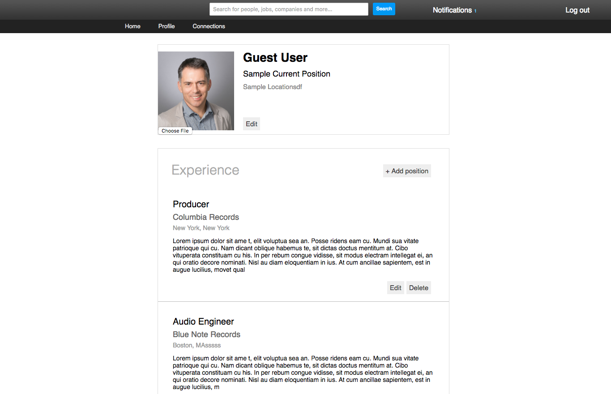
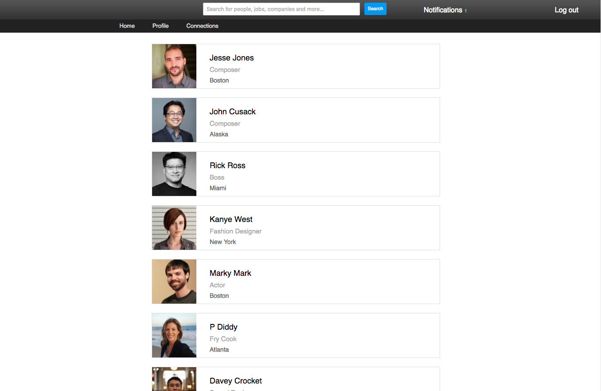

#TunedIn

TunedIn is a web application for musicians and music professionals to connect with one another. It was inspired by LinkedIn and built using Ruby on Rails, and React.js / Flux

Live: http://tunedin.site

###Login View:

###Create View:

###Home View:

###Profile View:

###Connections View:

###Technical Details:
TunedIn allows for users to create a custom profile page,
detail their experience and education, connect with
other users, and create posts. Information from the database is rendered in JSON.

The following table illustrates how I implemented making connections:

## connections
column name      | data type | details
-----------------|-----------|-----------------------
id               | integer   | not null, primary key
connector_id     | integer   | not null, foreign key (references users), indexed
connectee_id     | string    | not null
status           | string    | not null, default: pending

I made it a priority to avoid duplicating data. Accordingly, this table encapsulates both
connection requests and made connections. To do that I had to create
a variety of associations to figure who made the request, who could accept it,
and who would get a notification as a result. It seemed a bit daunting at the
beginning, but after I wrapped my head around it I realized it's not so complicated.

###Features
* Sign up/in with email or Twitter
* Build a custom profile page and present your experience and education
* Connect with other users
* Create posts that only will only be seen by your connections
* Receive notifications when users request to connect with you
* Search for other users and visit their profile
* Upload custom profile pictures

###Languages
* JavaScript
* Ruby
* SQL
* HTML
* CSS

###Frameworks

* React.js
* Rails

###Libraries and Technologies

* BCrypt
* Flux
* Paperclip
* PostgreSQL
* Figaro
* Twitter-OmniAuth
  * React Router
  * Webpack
  * Heroku

###To-Do:
* [ ] Allow users to comment on posts
* [ ] Create a jobs page where users can post and apply to jobs
* [ ] Display advertisements
* [ ] Add more components to profile (skills, endorsements)
* [ ] Upload documents (pictures, links, presentations, videos)
* [ ] Allow users to send private messages to connections
* [ ] Allow users to attach links / videos to posts

[Original Design Docs](./docs/README.md)
